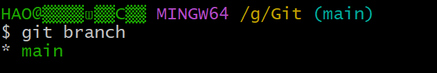

# 											   Git

## 															文章目录


------

## 一、Git的安装

1、官网地址：https://git-scm.com/downloads

2、选择自己需要的下载：


3、概述：

Git是一个版本管理系统
Git 是一个程序源代码的分布式版本管理系统。

4、文件初始化

创建一个文件夹---->进入文件夹----->右击------>Open Git Bash  here------>输入git init 创建本地仓库初始化


5.Git查看版本号：右击打开Git命令窗户，然后输入git -v、


### 二、Git的基本工作原理

1.Git 仓库：用于存放提交记录
2.Git暂存区：临时存放被修改文件
3.Git工作目录：被Git管理的项目

### 三、Git的使用

​        在使用git前需要告诉git 你是谁，在向git仓库中提交时需要用到（如果要进行修改的话直接整个过程再来一遍）在需要使用Git的工作文件夹中直接进行配置,只需要在第一次使用的时候进行配置
1.配置提交人姓名（最好使用全英文）：

```
git config --global user.name 提交人姓名
```


2.配置提交人姓名：

```
git config --globle user.eamil 提交人邮箱地址
```


3.查看git 的配置信息：

```
git config --list
```


## 四、提交步骤

工作流程图


```
本地仓库：是在开发人员自己电脑上的Git仓库,存放我们的代码(.git 隐藏文件夹就是我们的本地仓库)		
远程仓库：是在远程服务器上的Git仓库,存放代码(可以是github.com或者gitee.com 上的仓库,或者自己该公司的服务器)
工作区: 我们自己写代码(文档)的地方
暂存区: 在本地仓库中的一个特殊的文件(index) 叫做暂存区,临时存储我们即将要提交的文件
------------
Clone：克隆，就是将远程仓库复制到本地仓库
Push：推送，就是将本地仓库代码上传到远程仓库
Pull：拉取，就是将远程仓库代码下载到本地仓库,并将代码 克隆到本地工作区
```

1.创建一个本地仓库文件夹，在项目文件夹下打开Git命令行程序


2.git init -------->在项目文件夹下初始化一个Git仓库（会自动生成一个git文件夹)


3.git status ------>查看Git管理下项目文件夹的文件状态（被管理l【绿色】、没被管理【红色】）


4.git add 文件列表 ----->追踪（红色：未追踪）想要管理为文件（将Git管理下的文件添加到暂存区中）


5.git commit -m ”提交说明“ -----> 将暂存区中的文件提交到Git仓库中（每次提交值提交一个功能：减小后期维护难度）


6.git log ----->查看历史提交记录，可以看到提交ID


五、恢复记录和撤销：

1.查看提交版本确定需要回到的时刻点指令：

```
git log
git log --pretty=oneline
```

2、根据回退版本，将Git仓库中指定的更新记录恢复出来

```
git rest --hard commitID 
```

3.撤销：

 3.1、用暂存区中的文件覆盖工作目录中的文件：

```
git checkout 文件名字
```

 3.2、将文件从暂存区中删除：

```
git rm --cached 文件名称
```

 3.3、将git 仓库中指定的更新记录恢复出来，并且覆盖暂存区和工作目录：

```
git reset --hard commitID
```

4.回到撤销前：

要想回到未来，需要使用git reflog进行历史操作查看，得到最新的commit id；

```
git reflog commitID
```

在写回退指令的时候commit id可以不用写全，git自动识别，但是也不能写太少，至少需要写前4位字符；

5、查看远程仓库

查看远程  列出指定的每一个远程服务器的简写

```
git remote 
```

查看远程 , 列出 简称和地址

```
git remote  -v  
```

查看远程仓库详细地址

```
git remote show  <仓库简称>
```


## 五、Git进阶

分支：大家暂时可以认为分支就是当前工作目录中代码的一份副本，使用分支，可以让我们从开发主线上分离出来，以免影响主线的开发。

1.1分支细分：功能分支—>开发分支—>主分支

1)主分支（master）：第一次向git仓库中提交更新记录时自动产生的一个分支(根据时间来的)

2)开发分支(develop)：作为开发的分支，基于master分支创建，在开发分支中实现所需功能之后合并到主分支上，分支和分支之间时独立的。

3）功能分支(feature)：作为开发具体功能的分支，基于开发分支创建，专门用于功能开发，开发完成之后合并到开发分支上。

## 六、分支命令

1、git branch -------->查看分支（前面带*说明正处于该分支）



2、创建分支（前面带*号的为当前分支）：git branch 分支名称 -------->基于前面查看的正处于的分支创建分支


3、git checkout 分支名称 -------->切换分支（一定要保证当前工作目录已经提交到Git仓库中）


4、git merge 来源分支 -------->合并分支（先切换到主分支上，再将其他分支合并到主分支，虽然合并了但是开发分支还是存在）


5、git branch -d 分支名称 -------->删除分支（分支被合并后才允许删除，-D是强制删除，要先退出要删除的分支，然后才能删除 ），如果分支没有合并时不允许被删除的


## 七、暂时保存更改

在Git 中，可以暂时提取分支上所有的改变并存储，让开发人员得到一个干净的工作副本，临时转向其他工作

1、存储临时改动：

```
git stash
```

2、恢复改动（一定要切换会刚才需要临时存储的工作分支上）：

```
git stash pop
```

## 八、Github

这是一个远程仓库（公共的），用于和别人一起进行开发同一个项目的时候

## 九、多人协作开发流程


1、A在自己的计算机中创建本地仓库

2、A 在github中创建远程仓库

3、A 将本地仓库推送到远程仓库中

4、B 克隆远程仓库到本地仓库进行开发

5、B将本地仓库中开发大的内容推送到远程仓库

6、A将远程仓库中的最新内容拉到本地

## 十、将本地仓库推送到远程仓库中

1、将本地仓库推送到远程仓库

```
git push 远程仓库地址 分支名称
```

-u 记住推送地址及分支，下次推送只需要输入git push 即可

2、给远程仓库设置一个别称

```
git remote add 远程仓库地址别名 远程仓库地址 （给远程仓库地址添加一个别名）
```

3、程序员B克隆远程数据仓库到本地

```
git clone 远程仓库地址 
```

6、程序员A需要将程序员B推送的内容拉去到本地

6.1 拉取远程仓库中最新的版本：

```
git pull 远程仓库地址 分支名称
```


7.git pull 和git clone 的区别：

git pull 只是拉去远程仓库中的最新的版本,在已经有本地仓库的基础上。（这是拉取最新的【不一样的地方】）

git clone是完全克隆远程仓库，是在没有本地仓库进行的，只是在第一次开发的时候用到。（这是全部下载）

8.如果远程仓库的版本高于本地仓库版本，此时本地仓库是不能向远程仓库进行提交，本地仓库必须先拉去远程仓库的内容到本地仓库，然后再向远程仓库进行提交
**9.在每天工作的第一件事就是先git pull拉取线上最新的版本；每天下班前要做的是git push，将本地代码提交到线上仓库。**

## 十一、解决冲突

1、在多人同时开发一个项目时，如果两个人修改了同一个文件的同一个地方（后推送的人是无法推送的），就会发生冲突，冲突时需要人为取解决。

## 十二、跨团队协作

登陆自己的账户之后访问别人创建的仓库

1、程序员C fork仓库（将别人的仓库复制下来 ，并且放在程序员C自己的账户中）

2、程序员 C将仓库克隆在本地然后进行修改

3、程序员C将仓仓库推送到程序员C远程仓库

4、程序员C发起 pull resqest

5、原仓库作者审核

6、原仓库作者合并代码

## 十二、SSh免登陆

1、https协议仓库地址：

https://github.com/xxxxx/xxx.git


2、公钥(实现身份权鉴)：

放在Github 账户中 id_ras.pub 私钥：保存在开发者自己的电脑中id_ras

3、生成密钥：

```shell
ssh-keygen (一直回车)—>C\用户\当前所使用的系统用户
```

（有一个.ssh的文件）
4.id_rsa.push放在GitHub账户中

5、给ssh 地址添加一个别名：

```shell
git remote add 仓库地址别名 ssh地址
```

## shell十三、Git忽略清单

1、将不许要被Git管理的文件名字添加到此文件中，在执行git命令的时候，git就会忽略这些文件。git忽略清单文件名称：.gitignore，将不想被管理的文件夹的名字写在里面。

2、忽略文件需要新建一个名为.gitignore的文件（需要通过touch .gitignore来创建），该文件用于声明忽略文件或不忽略文件的规则，规则对当前目录及其子目录生效。

部分过滤规则;

```shell
常见规则写法有如下几种：
1）/mtk/          过滤整个文件夹
2）*.zip         过滤所有.zip文件
3）/mtk/do.c      过滤某个具体文件
4)!index.php      不过滤具体某个文件	
在文件中，以#开头的都是注释。
```

3、将工作目录中的文件全部添加到暂存区（实现同时添加多个）：git add . 。


## 十四、为仓库添加详细的说明

1、建一个.md文件，在里面进行说明，然后推送到远程仓库

## 十五、Git可视化系统

1、Github for Desktop


## 十六、Git对远程仓库的操作

#### 1、查看远程仓库

```shell
# 查看远程  列出指定的每一个远程服务器的简写
git remote 
# 查看远程 , 列出 简称和地址
git remote  -v  
# 查看远程仓库详细地址
git remote show  <仓库简称>
```

#### 2、 添加/移除远测仓库

```shell
# 添加远程仓库git remote add <shortname> <url># 移除远程仓库和本地仓库的关系(只是从本地移除远程仓库的关联关系，并不会真正影响到远程仓库)git remote rm <shortname> 
```

#### 3、从远程仓库获取代码

```shell
# 从远程仓库克隆
git clone <url> 
# 从远程仓库拉取 (拉取到.git 目录,不会合并到工作区,工作区发生变化)
git fetch  <shortname>  <分支名称>
# 手动合并  把某个版本的某个分支合并到当前工作区
git merge <shortname>/<分支名称>
# 从远程仓库拉取 (拉取到.git 目录,合并到工作区,工作区不发生变化) = fetch+merge
git pull  <shortname>  <分支名称>
git pull  <shortname>  <分支名称>  --allow-unrelated-histories  #  强制拉取合并
```

注意：如果当前本地仓库不是从远程仓库克隆，而是本地创建的仓库，并且仓库中存在文件，此时再从远程仓库拉取文件的时候会报错（fatal: refusing to merge unrelated histories ），解决此问题可以在git pull命令后加入参数--allow-unrelated-histories (如上 命令)

```shell
# 将本地仓库推送至远程仓库的某个分支
git push [remote-name] [branch-name]
```

#### 4、命令行-- 分支

```shell
# 默认 分支名称为 master
# 列出所有本地分支
git branch
# 列出所有远程分支
git branch -r
# 列出所有本地分支和远程分支
git branch -a
# 创建分支
git branch <分支名>
# 切换分支 
git checkout <分支名>
# 删除分支(如果分支已经修改过,则不允许删除)
git branch -d  <分支名>
# 强制删除分支
git branch -D  <分支名>
```


```shell
# 提交分支至远程仓库
git push <仓库简称> <分支名称>	
# 合并分支 将其他分支合并至当前工作区
git merge <分支名称>
# 删除远程仓库分支
git push origin –d branchName
```

#### 5、tag

```shell
# 列出所有tag
git tag
# 查看tag详细信息 
git show [tagName]
# 新建一个tag
git tag [tagName]
# 提交指定tag
$ git push [仓库简称] [tagName]
# 新建一个分支，指向某个tag
$ git checkout -b [branch] [tag]
# 删除本地tag
$ git tag -d [tag]
# 删除远程tag (注意 空格)
$ git push origin :refs/tags/[tag]
```

